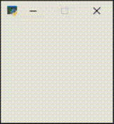

# nanoarch.py

A minimal working example of using a libretro core in Python based on <a href="https://github.com/heuripedes/nanoarch/blob/master/nanoarch.c">nanoarch.c</a>.

### How to run

(tested on windows, linux would require slight changes - .dll -> .so etc)

Install requirements from `requirements.txt` (`pip install -r requirements.txt`)

Fetch `sameboy_librertro` core from https://buildbot.libretro.com/nightly/windows/x86_64/latest/sameboy_libretro.dll.zip and extract it inside the same directory as main.py

Run `main.py`

### Whats working

- initializing libretro
- rendering gameboy frames inside SDL2 as a texture

### Whats not working

- Support for cores other than Game Boy due to hardcoded resolution & pixel format (easy to modify - call `retro_get_system_av_info` and use its information)

- Audio

Leaving it as is to keep code minimal, feel free to implement these in your own projects